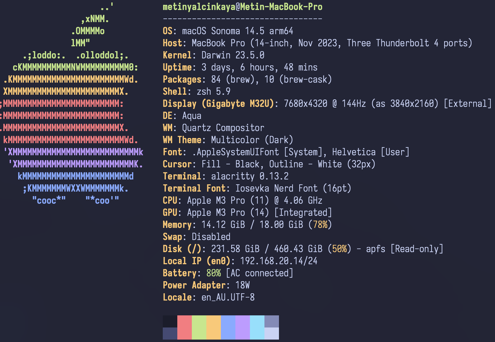

# dotfiles

## Setup

**OS:** MacOS

**Shell:** zsh + oh-my-zsh + powerlevel10k

**Terminal:** Alacritty + Tmux

**Theme:** Tokyonight

## Requirements

- Neovim
  - Ripgrep for telescope.nvim
- Nerd font
- Terminal that supports true colors
  - oh-my-zsh for the theme
- GNU Stow

## Installation

1. Install homebrew
2. Install GNU Stow `brew install stow`
3. Clone this repository (Preferably to ~/.dotfiles/)
4. Run `make` in your terminal from the ~/.dotfiles/ directory
